# Customer Scenario

## Login
Customer  | System
------------- | -------------
Navigates to `/accounts/login` directory of project  | Shows the `username` & `password` form.
Enter the `username` & `password` and clicks `login` | Validates entered `username` & `password` and if a valid admin shows admin panel.
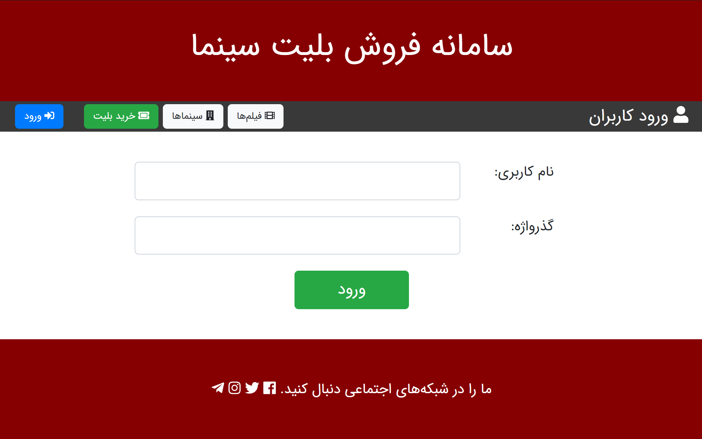
----
## Buy Ticket
* User can Buy (Create) a ticket by clicking on a showtime in showtime list available at `/showtime/list` directory of project > `خرید بلیت` button.
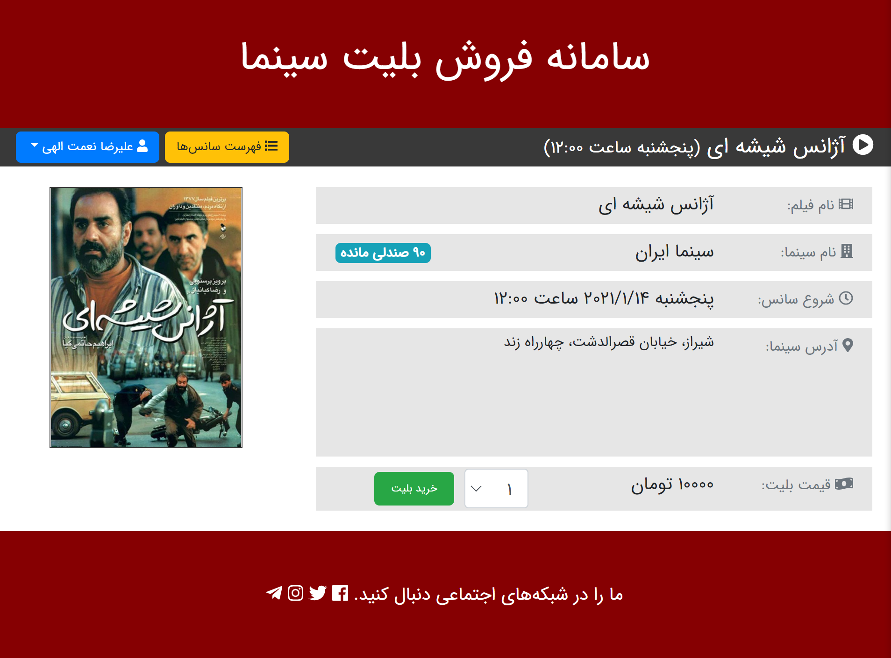
----

## Payments
* User can  Read his/her payments by clicking on `پرداخت های من`.
* User can Charge his/her account (Create) by clicking on `پرداخت جدید` button in `پرداخت های من` available at `accounts/payment/list` directory of project.
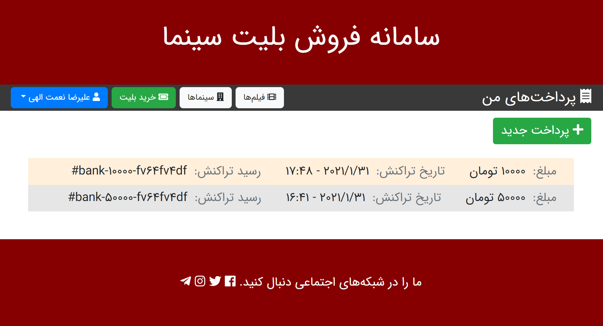
----

## User Profile
* User can  Read his/her profile by clicking on `نمایه کاربری`.
* User can  Update his/her profile details, change password and pay money by clicking on `ویرایش نمایه` , `تغییر گذرواژه` and `افزایش اعتبار` at `accounts/profile/details`
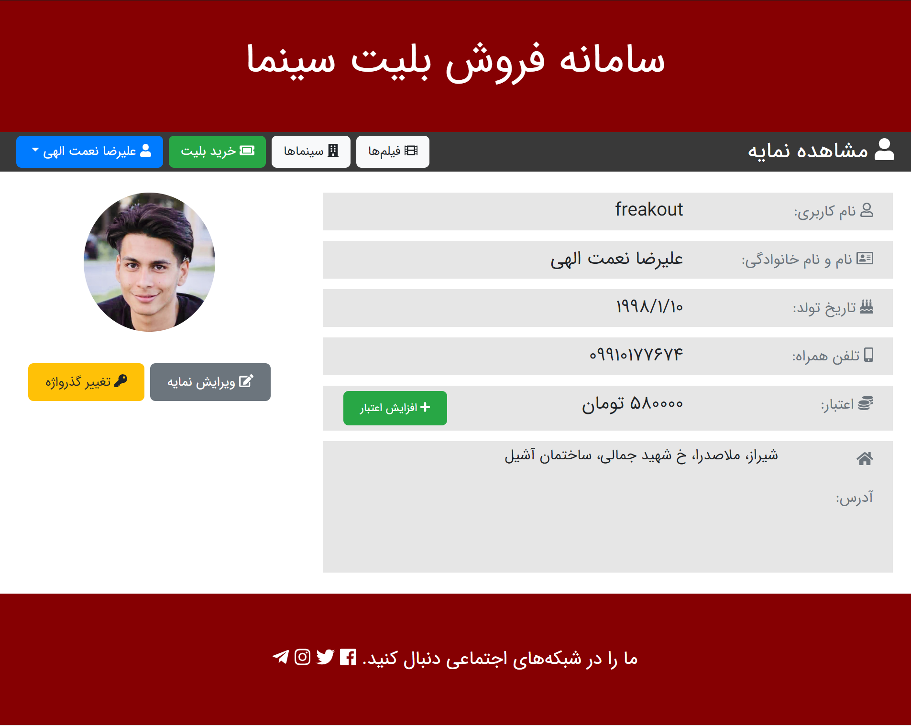
  ----
  
## User Tickets
* User can  Read his/her tickets by clicking on `بلیت های من` at `ticketing/ticket/list/`
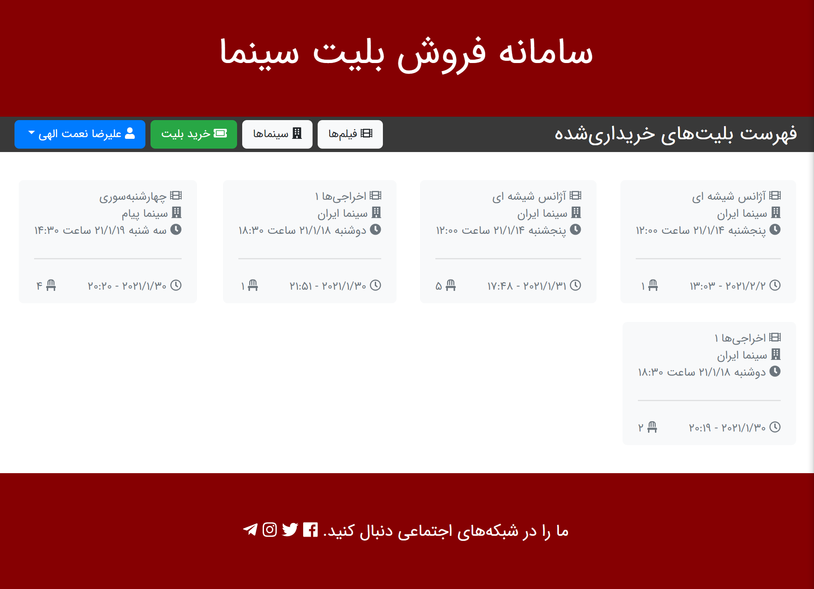
  ----
  
## Showtimes
* User can  Read available showtimes by clicking on `خرید بلیت`.
* User can  Search for desired showtimes by entering some details such as `عنوان فیلم`, `سینما`, `حداکثر و حداقل مدت زمان فیلم`, `محدوده قیمت` and `فقط سانس های قابل خرید` at `ticketing/showtime/list/` and clicking `جست و جو`.
  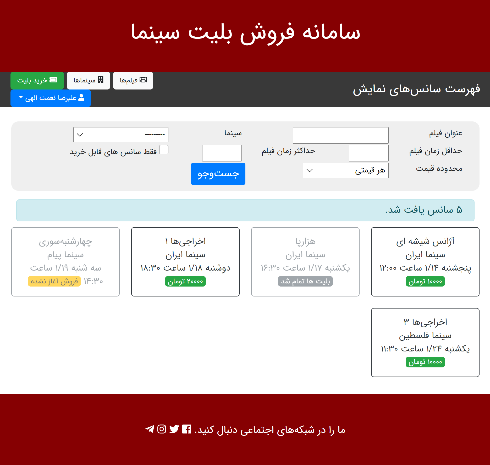
  ----

## Showtime Details
* User can  Read specific showtime details by clicking on each showtime (url: `ticketing/showtime/details/<showtime_id>/`)
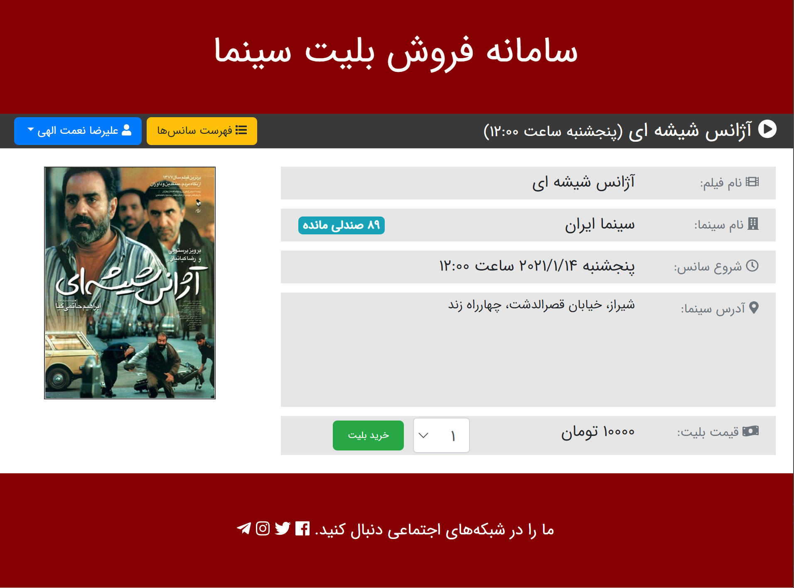
  ----
  
## Cinemas
* User can  Read available cinemas by clicking on `سینما ها` (url: `ticketing/cinema/list/`)
  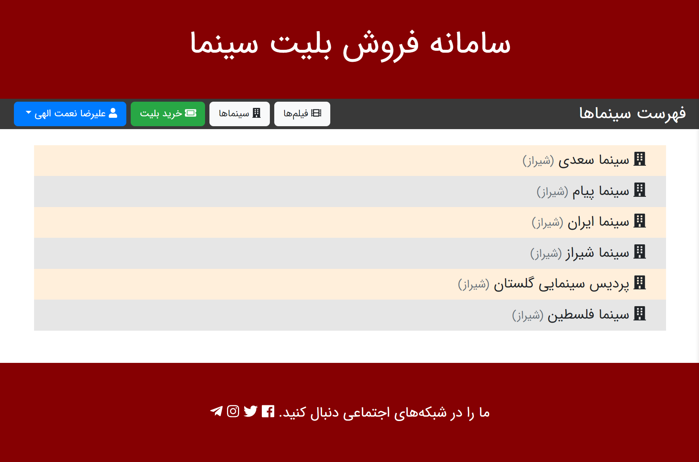
  ----
  
## Cinema Details
* User can  Read specific cinema details by clicking on each cinema (url: `ticketing/cinema/details/<cinema_id>/`)
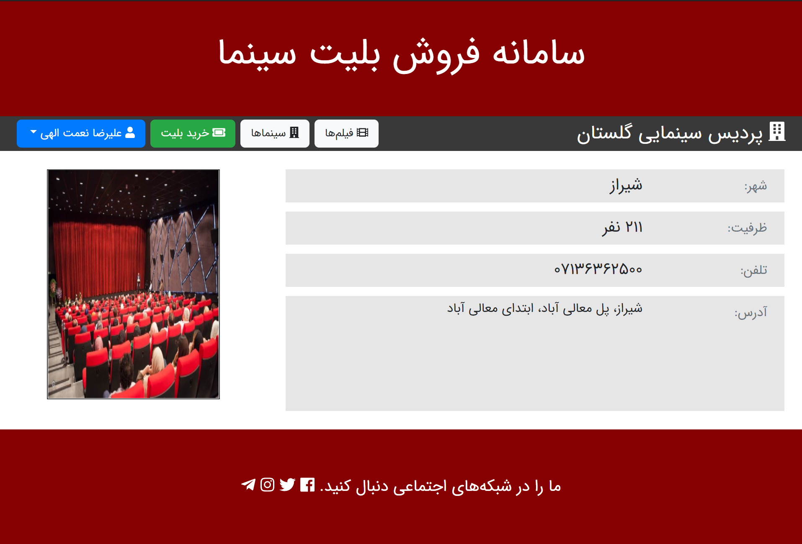
  ----

## Movies
* User can  Read available Movies by clicking on `فیلم ها` (url: `ticketing/movie/list/`)
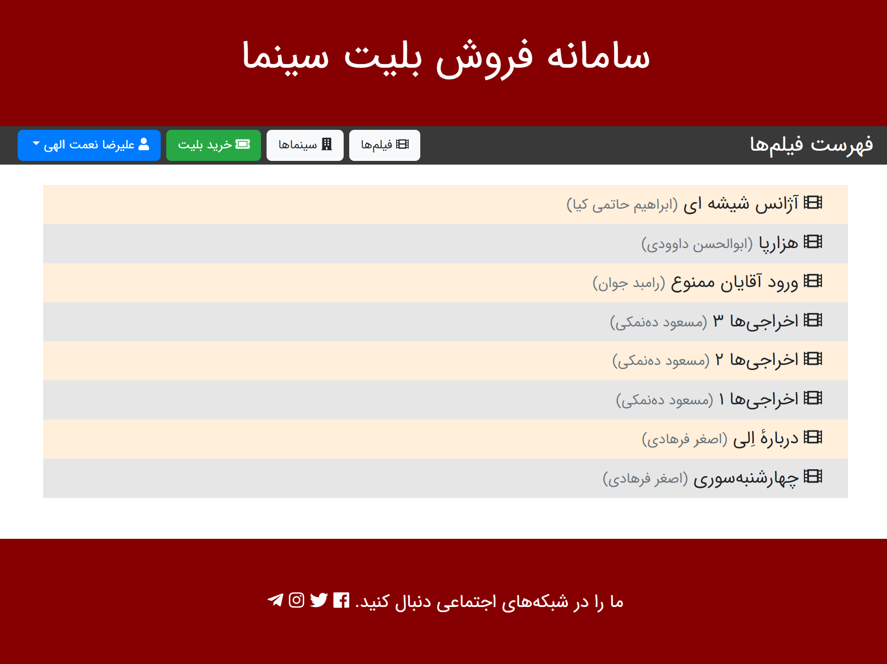
  ----
  
## Movie Details
* User can  Read specific cinema details by clicking on each movie (url: `ticketing/movie/details/<movie_id>/`)
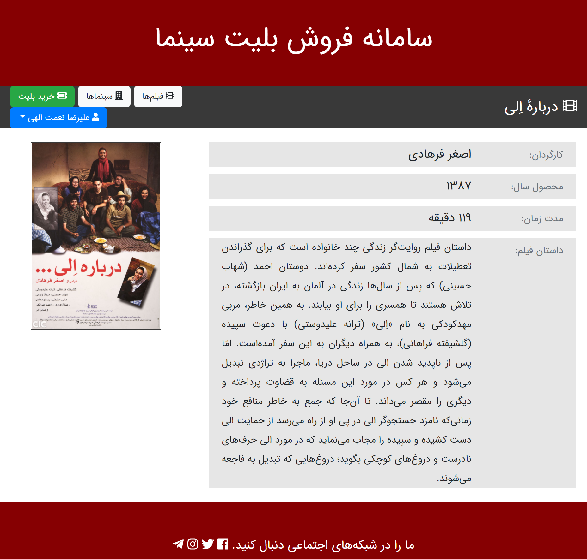
  ----

## Logout
* User can leave session by clicking on logout button (url: `accounts/logout/`)