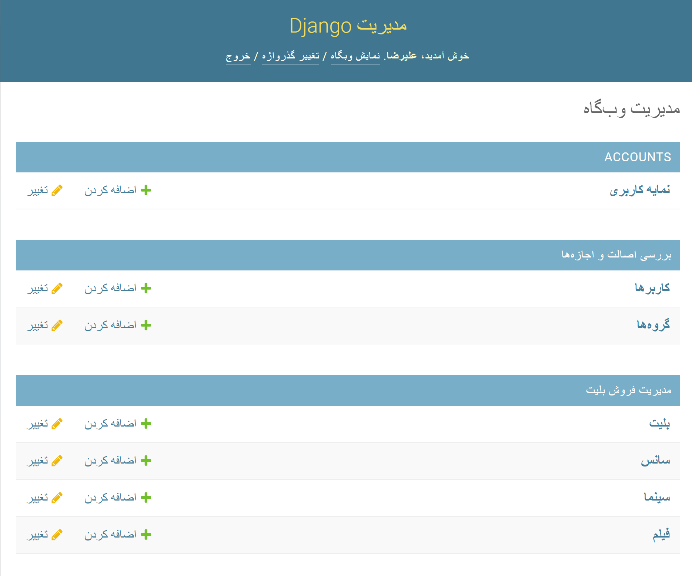

## Project Manager Scenario

Admin  | System
------------- | -------------
Navigates to `/admin` directory of project  | Shows the `username` & `password` form.
Enter the `username` & `password` and clicks `login` | Validates entered `username` & `password` and if a valid admin shows admin panel.
----

## Admin Controls
* Admin can Create, Read, Update and Delete **User Profiles**, **Tickets**, **Showtimes**, **Cinemas** and **Movies**.
